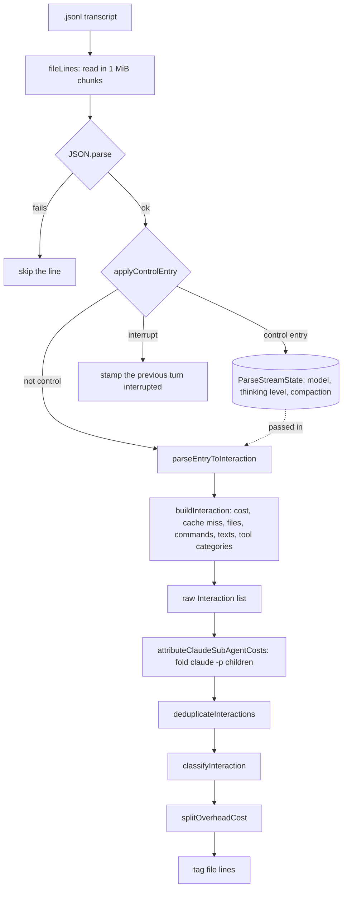
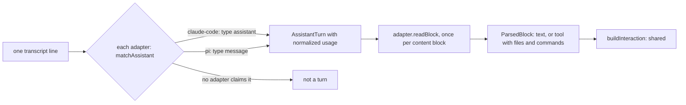
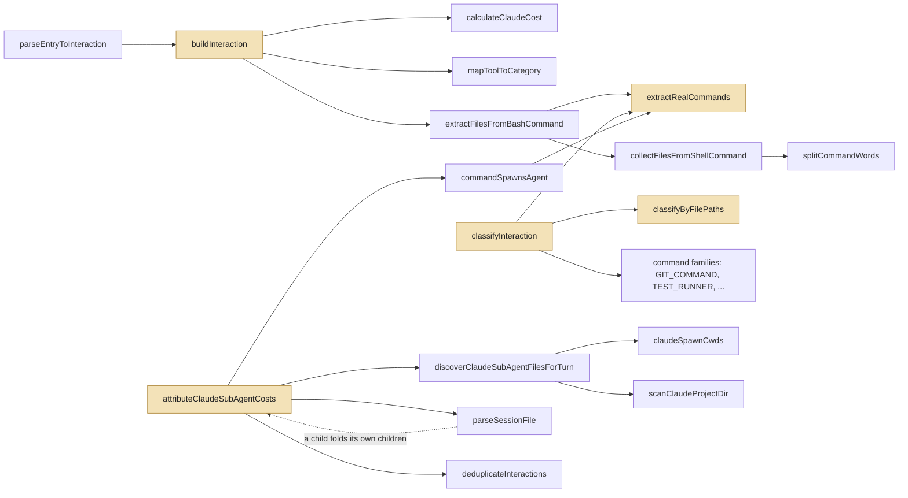
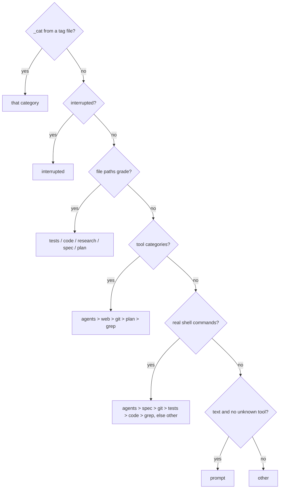

# The session log parser

A coding agent writes down everything it does. Claude Code and Pi each keep a transcript per session: a `.jsonl` file, one JSON object per line, holding every assistant reply with its token counts, every tool call, and every user message. The parser, `extensions/lib/wtft-parser.ts`, reads that file and answers two questions about each assistant reply: **what did it cost**, and **what kind of work was it**. The first answer is an `Interaction` record (dollars, tokens, the files it touched, the shell commands it ran, the text it wrote). The second is one of 14 categories (`code`, `tests`, `git`, `prompt`, …), which is the colour of that turn's cell in the wtft chart.

The parser has no process of its own. Its main caller is the log parser daemon, which reads each new transcript line as it is written, runs it through these functions, and writes the classified result to a tag file, so the CLI and the Pi widget never re-read the whole transcript. The [playground](#try-it-the-parser-playground) below runs the same functions in your browser.

## The one-minute version

1. **Read lines.** Each line is parsed as JSON; a line that does not parse is skipped.
2. **Control or turn?** A few lines are not replies but *signals*: the model changed, the user hit Escape, the context was compacted. They update a small running state and stop there. Every other line is offered to the harness adapters; an assistant reply becomes an `Interaction`.
3. **Fold children in.** A turn that ran `claude -p` in Bash started a second, separate session. The daemon finds that child's transcript and adds its cost to the turn that spawned it.
4. **Deduplicate.** Claude Code writes one line *per content block* of a reply, and each one repeats the reply's full token usage. Lines that share a message id are merged into one interaction.
5. **Classify.** `classifyInteraction` reads files, tool names, shell commands and text, in a fixed priority order, and names a category.
6. **Split overhead.** When part of a turn's bill was the cache being rebuilt rather than work, `splitOverheadCost` carves that share off as `overhead` or `compaction`.

## The pipeline

`parseSessionFile` is the whole-file entry point (used for subagent transcripts and one-off reads). The daemon runs the same per-line steps incrementally, as the transcript grows, in `extensions/lib/session-tagger.ts`.

`parseSessionFile` itself ends at the fold and returns the raw list; the dedupe, the classifier and the split are what the daemon does with it before writing a tag line (`serializeClassifiedWithOverheadSplit` in `wtft-daemon-lib.ts`).

## Two harnesses, one parser: the adapter seam

Claude Code and Pi describe the same things with different field names. The parser keeps that difference in one place. Each harness has a small **parse adapter** (`extensions/lib/harness/<id>/parse.ts`) that knows only *where a field lives*. Everything about *what a number means* (pricing, cache-miss detection, classification) is shared code on the far side of the seam, so a new harness cannot get billing wrong.

| | Claude Code | Pi |
|---|---|---|
| Assistant line | `type: "assistant"` | `type: "message"`, `role: "assistant"` |
| Tool call block | `tool_use` with `input` | `toolCall` with `arguments` |
| Usage fields | `input_tokens`, `cache_read_input_tokens`, … | `input`, `cacheRead`, `cacheWrite`, … |
| Cost | none: priced from tokens by `calculateClaudeCost` | `usage.cost.total`, used as is when present |
| Model | on every message | a `model_change` entry, carried in the stream state |
| Control entries | interrupt marker, `isCompactSummary` | `model_change`, `thinking_level_change`, `compaction` |

The first adapter whose `matchAssistant` claims a line wins. [Adding a harness](https://github.com/princess-pi/wtft/blob/main/docs/adding-a-harness.md) is two new files and no edit to shared code.

## The functions that matter

Most of the file's weight sits in five places: building an interaction, reading shell commands, grading file paths, classifying, and folding `claude -p` children. Those five are highlighted, and arrows are calls. The three entry points are `parseEntryToInteraction` (build a turn), `classifyInteraction` (name its category) and `attributeClaudeSubAgentCosts` (fold children).

`extractRealCommands` (in `wtft-command-shapes.ts`) is the one place a Bash string becomes "the commands that actually ran". Three different callers lean on it: file extraction, the classifier, and spawn detection.

## How complex is it

The parser is **1,587 lines** with **44 exports**. The table estimates cyclomatic complexity by counting branch points (`if`, loops, `case`, `catch`, `&&`, `||`, `??`, `?:`) in each function; it is a rough measure, but it points at the right places.

| Function | Branches (est.) | Lines | What makes it branchy |
|---|---:|---:|---|
| `classifyByFilePaths` | ~48 | 59 | path rules: `docs/`, `tests/`, `src/`, extensions, `node_modules` |
| `buildInteraction` | ~47 | 115 | optional usage fields, native vs priced cost, block kinds |
| `discoverSubagentSessionFiles` | ~38 | 105 | two harness layouts, unreadable-dir handling |
| `collectFilesFromShellCommand` | ~36 | 48 | inline scripts, redirections, readers vs editors |
| `classifyInteraction` | ~28 | 53 | the priority ladder and command families |
| `attributeClaudeSubAgentCosts` | ~25 | 80 | discovery, guards against double counting |
| `deduplicateInteractions` | ~25 | 70 | merging content and flags across copies |
| `scanClaudeProjectDir` | ~24 | 61 | timestamp window, per-file error handling |
| `splitOverheadCost` | ~19 | 45 | the recache test, compaction, rate-weighted split |

It is also **regex-dense**: 14 named patterns at the top level (`GIT_COMMAND`, `TEST_RUNNER`, `BUILD_COMMAND`, `FILE_READER`, `IN_PLACE_EDIT`, `INLINE_SCRIPT`, `NOT_A_REPO_FILE`, `PATHLIKE`, …) plus inline ones, used on about 30 lines. That is a deliberate trade. The parser reads shell strings and file paths the agent wrote, without a real shell parser, and it has to be fast because it runs on every line. Patterns anchored at the start of one already-stripped command are cheap and easy to extend; the rule throughout is to be conservative, because putting spend in the wrong category is worse than leaving it in `other`.

## How a turn gets its category

`classifyInteraction` walks a ladder. The first rung that has an answer wins.

**File paths** come from `Read`/`Edit`/`Write` tools and from shell commands that read or write files (`cat`, `sed -i`, `> out.txt`, `open('x','w')` in an inline Python script). Each path gets a class: `docs/research/` is `plan`; `docs/`, `README.md` and any `.md` are `spec`; `tests/` is `tests`; `research/` is `research`; `src/`, `extensions/`, `bin/` and code extensions are `code`. Scratch paths (`/tmp`, `/dev`, `/etc`, …) are ignored. Then **writes beat reads**, and among equals the latest workflow stage wins: tests > code > research > spec > plan. So reading `README.md` and editing `tests/x.test.ts` in one reply is `tests`.

**Tool categories** come from tool names: `Task` and `Agent` are `agents`, `WebSearch` and MCP search tools are `web`, `Grep`/`Glob` are `grep`, `TodoWrite` is `plan`. A tool the parser has never heard of sets `unrecognizedTool`, which keeps the turn out of `prompt`.

**Shell commands** are first stripped by `extractRealCommands`, then each real command's first line is matched against command families.

| Bash string | Real commands | Category |
|---|---|---|
| `cd ~/proj && FOO=1 timeout -k 5 200 bun test tests/foo.test.ts 2>&1 \| tail -20` | `bun test tests/foo.test.ts 2>&1`, `tail -20` | `tests` |
| `git status && gh issue view 42` | `git status`, `gh issue view 42` | `spec` (the `gh issue view` carve-out beats `git`) |
| `while true; do sleep 5; curl -s localhost; done` | `curl -s localhost` | `other` |
| `sudo -u root git status` | `git status` | `git` |
| `cd /repo/sub && claude -p '…' \| tee /tmp/out.txt` | `claude -p '…'`, `tee /tmp/out.txt` | `agents` |

Twelve categories come out of the classifier. The other two, `overhead` and `compaction`, are never a whole turn: they are the slice `splitOverheadCost` cuts off, written as a second tag line.

## Control entries: interrupts, models, compaction

A control entry changes state and is never itself a turn.

| Signal | Harness | Effect |
|---|---|---|
| `interrupt` | Claude Code: a user text block containing `[Request interrupted by user` | the *previous* turn is marked `interrupted`; its whole cost is waste |
| `after-compaction` | Claude Code: `isCompactSummary: true` | the next turn is `afterCompaction` |
| `compaction` | Pi: `type: "compaction"` with `tokensBefore` | the next turn is `afterCompaction` and carries `tokensBefore` |
| `model` | Pi: `model_change` | the model used to price the turns after it |
| `thinking-level` | Pi: `thinking_level_change` | stamped on the turns after it |

The interrupt marker only counts in a user entry's own text, never inside a tool result, so a transcript that merely mentions the phrase does not reclassify anything. After the dedupe, an interrupted copy marks the whole merged message.

## Cache misses and overhead

Every turn re-sends the whole conversation. Normally most of it is a **cache read** (cheap) and only the new tail is a **cache write**. `buildInteraction` flags a **cache miss** when a main-session turn read nothing from cache but wrote to it: the cache had expired, typically after a pause longer than its TTL. The chart draws a `── Cache Miss ──` line there. A subagent's first turn always looks like this, so sidechain turns are never flagged.

`splitOverheadCost` goes one step further and decides how much of the bill was *rebuilding*, not working:

- **compaction**: the turn right after a compaction; its cache write is the cost of the new summary context.
- **overhead** (a recache): more than 30k tokens written, almost no fresh input, under 20% read from cache, and a total context within 15% of the previous turn's. The context did not change; it was just re-bought.

The slice is the cache write's rate-weighted share of the turn's cost, so the totals still add up and Pi's native costs split the same way. The daemon writes the turn twice: the remainder in its own category, and the slice as an `overhead` or `compaction` line.

## Folding in `claude -p` children

Some turns start another agent. A `Task` tool call runs a subagent inside Claude Code, whose transcript lands under the session's `subagents/` directory; the daemon reads those and adds their turns to the session as they are. A Bash call to `claude -p` is different: it starts a whole separate session, filed under its own project directory, with nothing in the parent's transcript but the command. Without help, that spend would vanish.

`attributeClaudeSubAgentCosts` closes the gap:

1. `commandSpawnsAgent` finds turns whose real commands run `claude` (not `cat CLAUDE.md`, not heredoc text).
2. `claudeSpawnCwds` works out where each spawn ran, from the last `cd` before it, or the session's own directory when there is none.
3. Discovery looks in that directory's Claude project folder for transcripts whose first timestamp is within ±15 seconds of the spawning turn.
4. Each match is parsed with `parseSessionFile`, which may fold *its* children in turn. The child's own share (excluding grandchildren it already folded) is added to the spawning turn's tokens and cost, and recorded as a fold.

Guards keep this honest: a session id is counted once per call, a transcript never folds itself or an ancestor, and an unreadable child throws rather than silently reporting $0.

## Try it: the parser playground

The presets walk the paths above: wrapper stripping, the `gh` carve-out, a merge by message id, a cache miss with a recache split, an interrupt, Pi's native cost and model entries, compaction, and a `claude -p` spawn. Edit the lines and the result follows. Click a command to see how `extractRealCommands` strips it.

<iframe src="playground.html" title="Parser playground" style="width:100%;height:1100px;border:1px solid #444;border-radius:8px;background:#161616"></iframe>

[Open the playground on its own](playground.html)

## Further reading

- [Spec 52: finer-grain categories](https://github.com/princess-pi/wtft/blob/main/docs/spec-52-finer-grain-categories.md): why the categories are what they are.
- [Adding a harness](https://github.com/princess-pi/wtft/blob/main/docs/adding-a-harness.md) and [spec 156: the harness seam](https://github.com/princess-pi/wtft/blob/main/docs/spec-156-155-harness-seam-and-daemon-follow.md).
- [Spec 97: streaming parse](https://github.com/princess-pi/wtft/blob/main/docs/spec-97-streaming-parse.md): reading a transcript in chunks.
- [Spec 107: spawn discovery](https://github.com/princess-pi/wtft/blob/main/docs/spec-107-spawn-discovery.md) and [spec 149: compaction cost](https://github.com/princess-pi/wtft/blob/main/docs/spec-149-compaction-cost-scope.md).
- [Tag file format](https://github.com/princess-pi/wtft/blob/main/docs/wtft-tag-format.md): what the daemon writes.
- [Chart spec](../chart-spec/spec.mdx): where the categories become colours.
